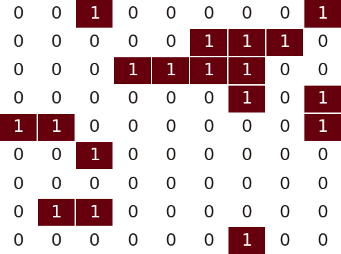
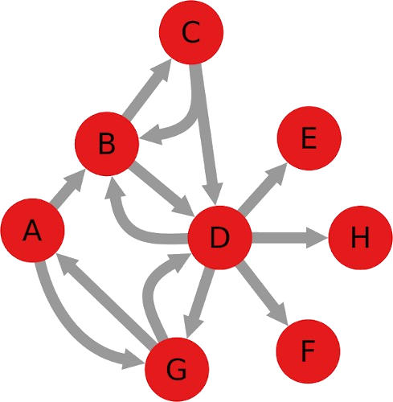

# Conceptual Questions on Graphs and Networks:

1. Define:

	(a) Subgraph
	(b) Bipartite graph.
	(c) Hamiltonian graph
	(d) Eulerian graph.

2. Describe how a breadth-first search algorithm works.

3. How many edges does a complete graph with n vertices have? What about a complete directed graph with n vertices?

4. What are isomorphic graphs? Draw an example.

5. Calculate the degree of the nodes for both node types in the bipartite adjacency matrix from the figure below. Find the isolated node(s).

6. Given the digraph `G = (V, E)` where `V = {M, N, O, P, Q, R, S}` and 

`E ={(M, S), (N, O), (P, R), (N, S), (O, M),
	 (N, Q), (O, M), (P, P), (S, M), (O, N), 
	 (S, M), (N, R), (P, M), (M, S)}`

	(a) Specify, if any, a simple path from vertex M to vertex S.

	(b) Specify, if any, a simple cycle, involving at least 4 nodes.

	(c) Is the digraph connected or not connected?

	(d) What is the degree of vertices N and R.

	(e) Represent the digraph using adjacency list representation.

	(f) Represent the digraph using adjacency matrix representation.

7. Draw the undirected and directed versions of the graph G(V, E), where V = {1, 2, 3, 4, 5, 6} and E = {(2, 5), (6, 1), (5, 3), (2, 3)}.

8. How many edges does a graph have 3 vertices of degree 3 and one vertex of degree 5?

9. Mr. A is friend with Mrs. B, but she doesn't like him back. She has a reciprocal friendship with both C and D, but only C considers D a friend. D has also sent friend requests to E, F, G, and H but, so far, only G replied. G also has a reciprocal relationship with A. Draw the corresponding directed graph.

10. Draw the graph from the previous exercise as undirected and weighted, with the weight being 2 if the connection is reciprocal, 1 otherwise.
    
11.  Consider the following network representation using adjency list:

	A: F B 
	B: A F
	C: D I
	D: E C I
	E: D J I
	F: A B
	G: H
	H: G
	I: J E C D
	J: I E
	(a) Show the result of the breadth-first search (BFS) and depth-first search (DFS) starting from vertex A.
	(b) Also show the distance from each vertex to vertex A.
 	(c) Obtain the connected components of a graph using the depth-first search (DFS) algorithm.

12. Considering the network below, define and exemplify the following concept:

    - Adjacency matrix.
    - Diameter and periphery of the network.
    - Empirical degree distribution histogram.
    - Local clustering coefficient for chosen nodes.
    - Global clustering coefficient.
    - Strongly Connected Components
    - Weakly Connected Components.
    - Degree centrality.
    - Closeness centrality.
    - Betweenness centrality.
    - Eigenvector centrality.

# Dissertative questions on Random networks, Small worlds, and  Scale-free networks:

## 1. Random Networks (Erdős–Rényi Model)

1.1 What is the main difference between the Erdős–Rényi G(n, p) and G(n, m) models?

1.2 How does the probability parameter pp affect the connectivity of a random graph?

1.3 At what critical value of pp does a giant component typically emerge in the Erdős–Rényi model?

1.4 What is the expected degree of a node in a random network with nn vertices and edge probability pp?

1.5 Why do random networks tend to have a Poisson degree distribution?

## 2. Small-World Networks (Watts–Strogatz Model)

2.1 Explain how the Watts–Strogatz model interpolates between a regular lattice and a random network.

2.2 What is the effect of the rewiring probability pp on the clustering coefficient and average path length?

2.3 Why do small-world networks often exhibit both high clustering and short average path lengths?

2.4 Describe a real-world system that can be modeled as a small-world network and explain why.

2.5 How do you compute the clustering coefficient of a node in a small-world network?

## 3. Scale-Free Networks (Barabási–Albert Model)

3.1 What does it mean for a network to be "scale-free"?

3.2 What is preferential attachment and how does it lead to a power-law degree distribution?

3.3 Write the expression for the probability P(k)P(k) that a node has degree kk in a scale-free network.

3.4 How do hubs emerge in scale-free networks and what is their significance?

3.5 Discuss one advantage and one disadvantage of scale-free networks in terms of robustness and vulnerability.

# Multiple Choice Questions  on Random networks, Small worlds, and  Scale-free networks:

## 🧩 Random Networks (Erdős–Rényi Model)

**1.1 What is the main difference between the Erdős–Rényi G(n, p) and G(n, m) models?**

* [ ] A) G(n, p) uses fixed edges; G(n, m) uses probabilistic edges
* [ ] B) G(n, p) uses a fixed number of edges; G(n, m) uses a probability for edge creation
* [ ] C) G(n, p) fixes the edge probability; G(n, m) fixes the number of edges
* [ ] D) G(n, p) is used only for directed graphs

**1.2 In the G(n, p) model, increasing the value of $p$:**

* [ ] A) Increases the clustering but not connectivity
* [ ] B) Reduces the number of isolated nodes
* [ ] C) Increases the likelihood of edges forming between nodes
* [ ] D) Has no effect after a critical threshold is reached

**1.3 What typically occurs at the critical threshold $p_c = \frac{1}{n}$ in a random network?**

* [ ] A) The network becomes disconnected
* [ ] B) All nodes have the same degree
* [ ] C) A giant component emerges
* [ ] D) The clustering coefficient becomes zero

**1.4 What is the expected degree $\langle k \rangle$ of a node in a G(n, p) network?**

* [ ] A) $\frac{2m}{n}$
* [ ] B) $np$
* [ ] C) $\frac{1}{n}$
* [ ] D) $\log(n)$

**1.5 What kind of degree distribution is characteristic of a random network?**

* [ ] A) Power law
* [ ] B) Exponential
* [ ] C) Binomial (or Poisson for large n)
* [ ] D) Uniform

---

## 🌐 Small-World Networks (Watts–Strogatz Model)

**2.1 What does the rewiring process in the Watts–Strogatz model accomplish?**

* [ ] A) Increases average degree
* [ ] B) Reduces the number of nodes
* [ ] C) Introduces long-range connections, reducing path lengths
* [ ] D) Increases the clustering coefficient

**2.2 How does increasing the rewiring probability $p$ affect a small-world network?**

* [ ] A) Both clustering and path length increase
* [ ] B) Clustering decreases and path length increases
* [ ] C) Clustering decreases and path length decreases
* [ ] D) No significant effect on network properties

**2.3 What is a hallmark property of small-world networks?**

* [ ] A) Long average path lengths
* [ ] B) Power-law degree distribution
* [ ] C) High clustering and short average path lengths
* [ ] D) Uniform degree distribution

**2.4 Which of the following is a real-world example of a small-world network?**

* [ ] A) A fully connected mesh network
* [ ] B) The global air transportation system
* [ ] C) The neural network of *C. elegans*
* [ ] D) A tree data structure

**2.5 The clustering coefficient of a node measures:**

* [ ] A) Its centrality in the network
* [ ] B) The number of shortest paths passing through it
* [ ] C) The probability its neighbors are connected to each other
* [ ] D) The node’s degree normalized by the maximum degree

---

## 📈 Scale-Free Networks (Barabási–Albert Model)

**3.1 A network is "scale-free" when:**

* [ ] A) All nodes have the same degree
* [ ] B) It has no characteristic path length
* [ ] C) Its degree distribution follows a power law
* [ ] D) It has constant clustering

**3.2 Preferential attachment means:**

* [ ] A) New nodes attach randomly
* [ ] B) Nodes prefer attaching to neighbors of neighbors
* [ ] C) Nodes attach to high-degree nodes with higher probability
* [ ] D) All nodes start with equal degree

**3.3 What is the form of the degree distribution $P(k)$ in scale-free networks?**

* [ ] A) $P(k) \sim e^{-k}$
* [ ] B) $P(k) \sim \log(k)$
* [ ] C) $P(k) \sim k^{-\gamma}$
* [ ] D) $P(k) \sim \frac{1}{n}$

**3.4 Why are hubs significant in scale-free networks?**

* [ ] A) They reduce clustering
* [ ] B) They increase average path lengths
* [ ] C) They concentrate connectivity and play a central role in network dynamics
* [ ] D) They are removed quickly in failures

**3.5 Which of the following is **true** about the robustness of scale-free networks?**

* [ ] A) They are robust to targeted attacks
* [ ] B) They are fragile to random node removal
* [ ] C) They are robust to random failures but vulnerable to targeted attacks
* [ ] D) They behave identically to random networks
